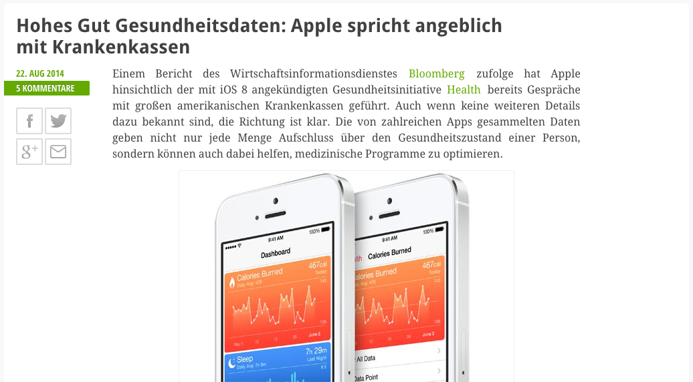
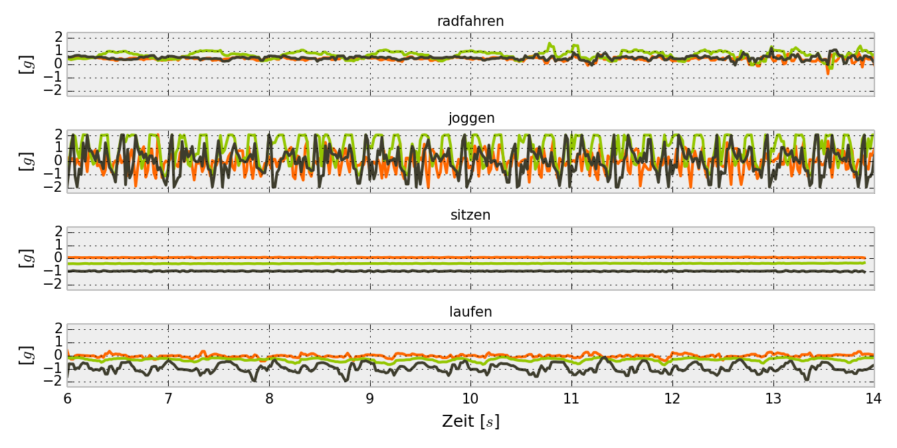
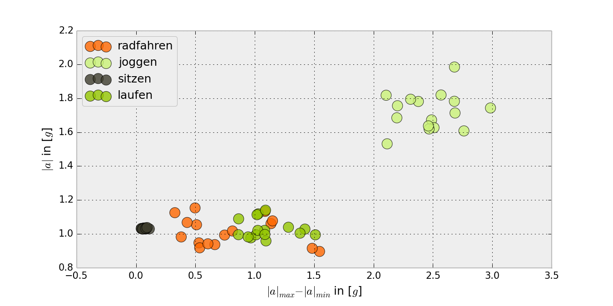
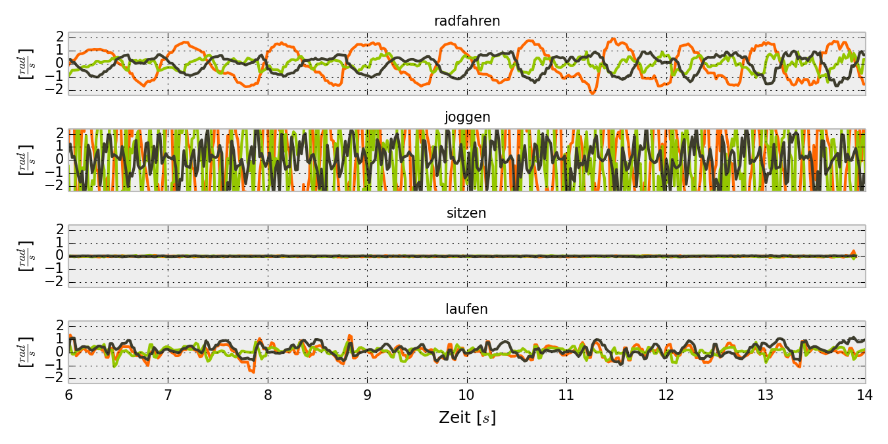
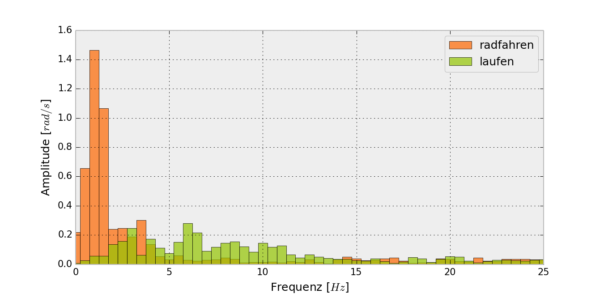
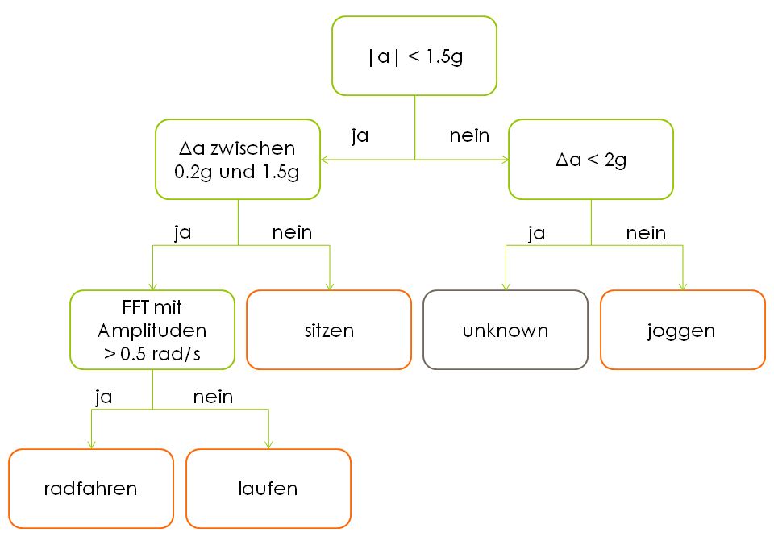
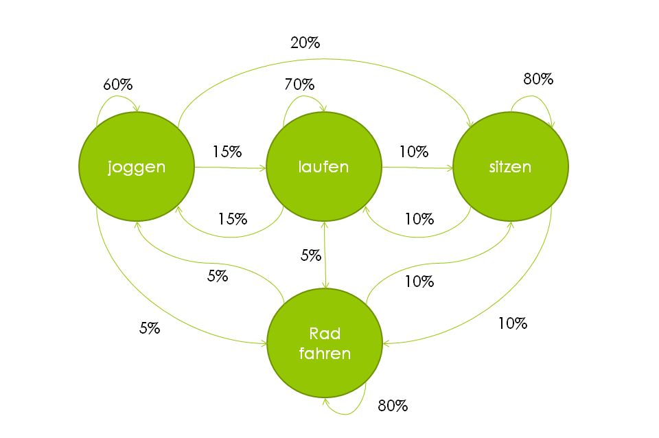
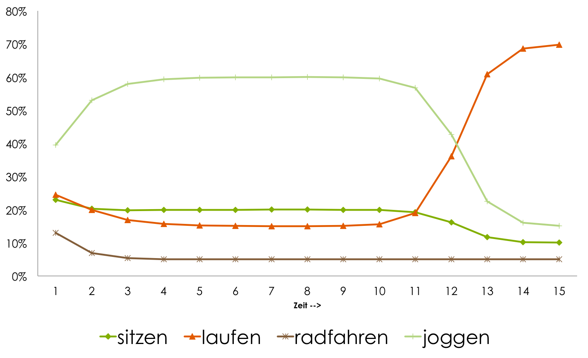
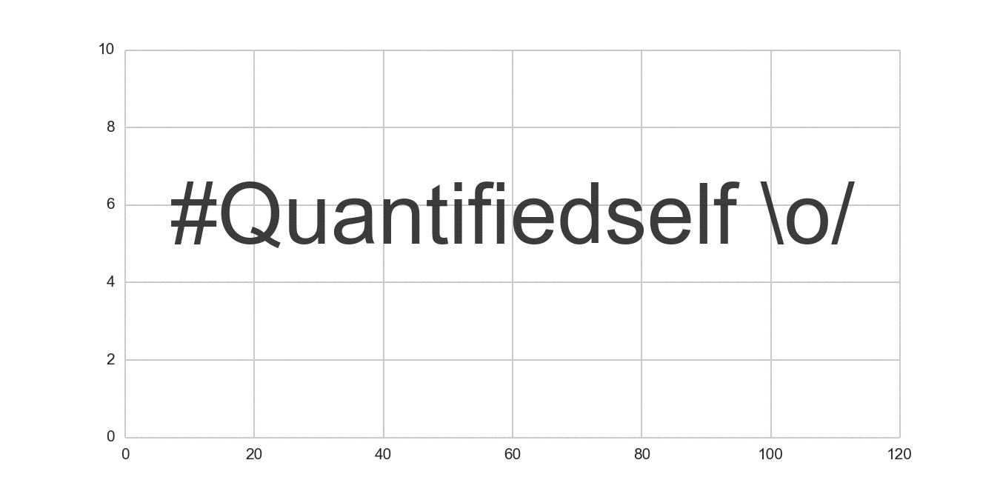

theme: sudodoki/reveal-cleaver-theme
title: Datenspuren 2014 Talk - Hack the (Gesundheits-)System, wenigstens n'bisschen
author:
  name: Thanks for attention!
  twitter: balzer82
  url: http://balzer82.github.io/
output: Presentation.html
controls: true

--

## Hack the (Gesundheits-)System
### - wenigstens n'bisschen
- Was deine Katze mit deinem Krankenkassenbeitrag zu tun haben wird -

~ Paul Balzer ~

--

### Das erwartet euch

1. Worum geht es?
2. Test
3. Wie machen sie es?
3. Auswirkungen

--

# #QuantifiedSelf

* Fitbit Flex
* Jawbone UP!
* Nike Fuelband
* iPhone M7 Motion Co-Prozessor
* ...

--

### Worum geht es eigentlich?

--

### Wie machen sie es?

### 4 Beispiele mit Smartphonesensoren aufgezeichnet

* Laufen mit Telefon in der Hand
* Joggen mit Telefon in der Hosentasche
* Radfahren mit Telefon in der Hosentasche
* Sitzen mit Telefon in der Hand

--

## Physikalische Werte (1)

### Beschleunigungen

--

## Klassifikator (1)

Mit Beschleunigungsklassifikator kann man schon mal Sitzen/Joggen auseinander halten, Laufen und Radfahren allerdings nicht (grüne Punkte)

--

## Physikalische Werte (2)

### Drehraten

--

## Klassifikator (2)

### FFT

Charakteristische Frequenz (Trittfrequenz) in Amplitudenspektrum erkennbar.

--

## Klassifikator

(Beispiel - kein Anspruch auf Vollständigkeit, Ähnlichkeiten zu realen Implementierungen zufällig)

--

## Hidden Markov Model

Es gibt einen Zustand (hidden), den man nicht 'messen' kann, aber es gibt entsprechende Wahrschenlichkeiten, dass ein Zustand einen bestimmten Ouput erzeugt (Klassifikator). Außerdem gibt es Wahrscheinlichkeiten für einen Zustandsübergang:

--

## Aktivitätenerkennung

--

## Versicherungsmathematik

#### State-of-the-Art

1. Alter
2. Beruf
3. Vorerkrankungen
4. Raucher
5. ...

=> Risiko für bestimmte Krankheiten > voraussichtliche Kosten > Risikoeinstufung > Krankenkassenbeitrag

--

## Versicherungsmathematik

#### Zukunft

1. tägliche Schritte
2. Schlaf, Tiefschlaf Stunden
3. Regelmäßigkeiten
4. Ernährung
5. ...

=> statistische Auswirkungen und Belastbarkeit der #Quantifiedself Angaben werden derzeit ermittelt

--

## Auswirkungen

### Kurzer Abschweif: Blick auf KFZ Versicherungen

*Hier Bild von Sparkasse Versicherungstarif*

---

## Auswirkungen

Vermutung:

Wobei sich die Höhe der Rabatte auf die individuellen Risikominimierungen (Versicherungsmathematik) ggü. bestimmten Krankenheiten ergeben wird

--

## Was können wir tun?

Ich denke: Nichts.

Die Begehrlichkeiten sind zu groß. Stichworte: Smartwatch, Wearables, ...
Die Daten werden erhoben, wir müssen damit leben.

--

## Aufruf

Social Re-Engineering 